[](https://github.com/abdsaf/flask-sklearn/actions/workflows/main.yml)

# Azure DevOps Project: Building a CI/CD Pipeline

# Overview

This project describe the DevOps CI/CD concepts. using Azure pipeline and Github Actions for automating build, test and deploy ML web application. 

## Project Plan


* The [Trello board](https://trello.com/invite/b/DgIKN6Gr/ATTI86c6a28cc823036647e817f224198a032C19BB1F/yearlyquarterly-plan) is then used for task planning and tracking.
* The [quarterly project plan](../../raw/main/plan/CI-CD_yearly_quarterly_project_plan.xlsx) the steps for building CI-CD pipeline.

## Instructions
The below diagram shows the project architecture.  

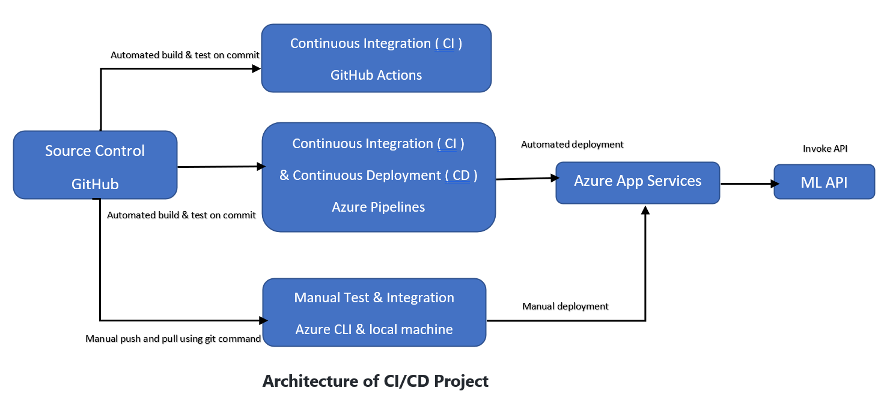

The source code are in GitHub repo, actually GitHub Actions perform CI. therefore once any change happend on repo the GitHub Actions can atomatically check the code by build and test.

on Azure the Github repo was cloned and the Azure app was built, so you can build and test the code locally. also the code was deployed locally to Azure app serive.
so you can test the API by invoke it via web app.

Azure pipline perform CI/CD by pulling the code from GitHub, Build, Test and Deploy it to Azure app service.

### Cloning GitHub Repo and Testing Locally

open the Azure cloud shell by using your credential.

Clone project from GitHub and change to the project directory:
```bash
odl_user [~]$ git clone https://github.com/abdsaf/flask-sklearn.git
odl_user [~]$ cd flask-sklearn
```

Create python virtual env & source :
```bash
odl_user [~/flask-sklearn]$ python3 -m venv ~/.flask-sklearn
odl_user [~/flask-sklearn]$ source ~/.flask-sklearn/bin/activate
```

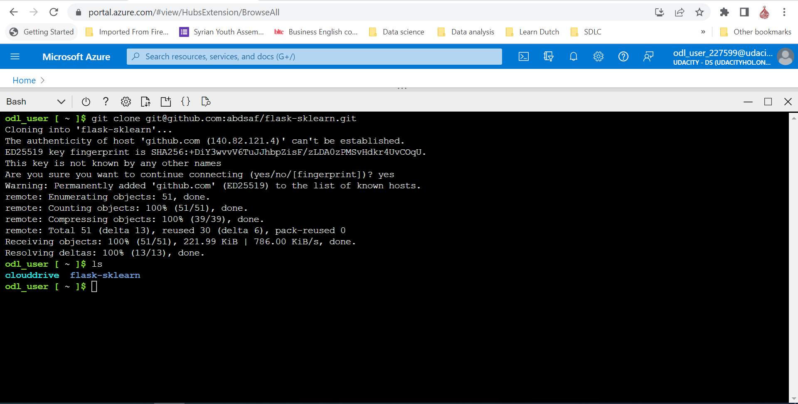


Build & Test code locally which mean install needed packages and testing it:
```bash
(.flask-sklearn) odl_user [~/flask-sklearn]$ make all
```

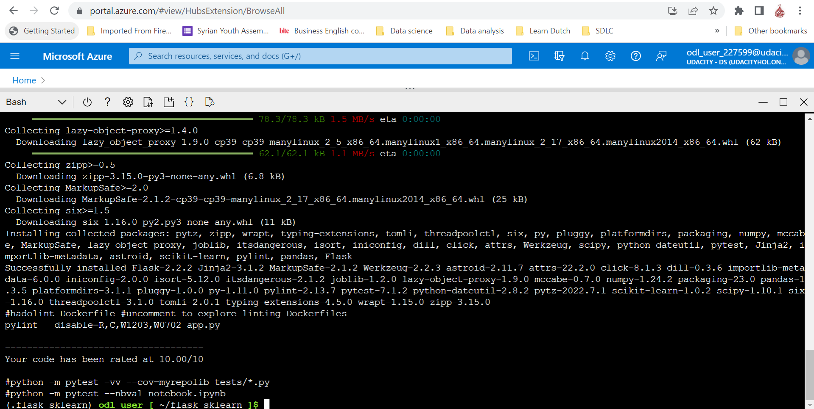


Run the application locally:
```bash
(.flask-sklearn) odl_user [~/flask-sklearn]$ flask run
```


Test code locally in new Azure shell by source the env it locally in a new Azure cloud shell (the Azure cloude shell is blocked by 'flask run') :
```bash
odl_user [~]$ source ~/.flask-sklearn/bin/activate
(.flask-sklearn) odl_user [~]$ cd flask-sklearn/
(.flask-sklearn) odl_user [~/flask-sklearn]$ ./make_prediction.sh
```

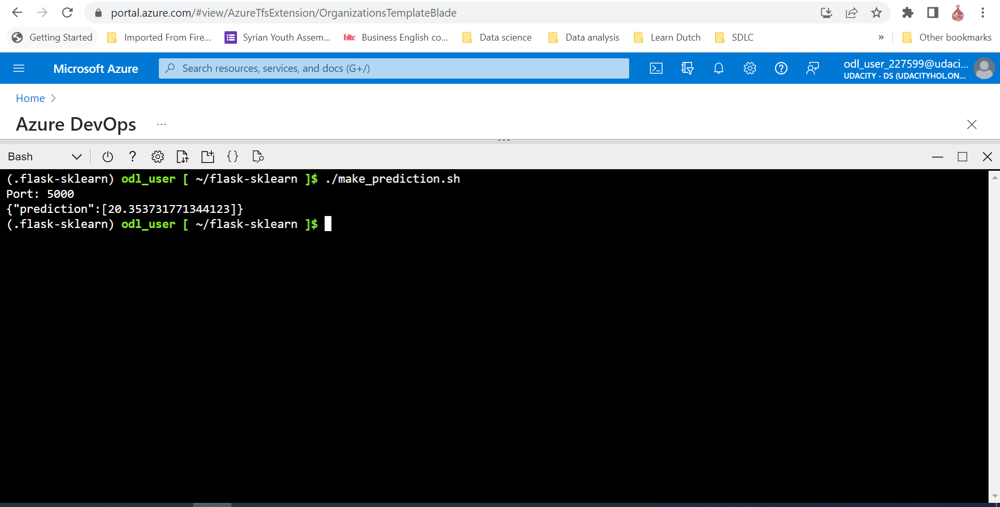


### Provisioning CI using Github Actions
Now after you have performed all previous steps , you can performe CI by using GitHub Action.

From the top bar of GitHub click on 'Actions', then click on "set up a workflow yourself' and use the GitHub Actions template yaml file located in  [.github/workflows/main.yml]

Once you create this workflow so it will run automatically to build code in Repo:
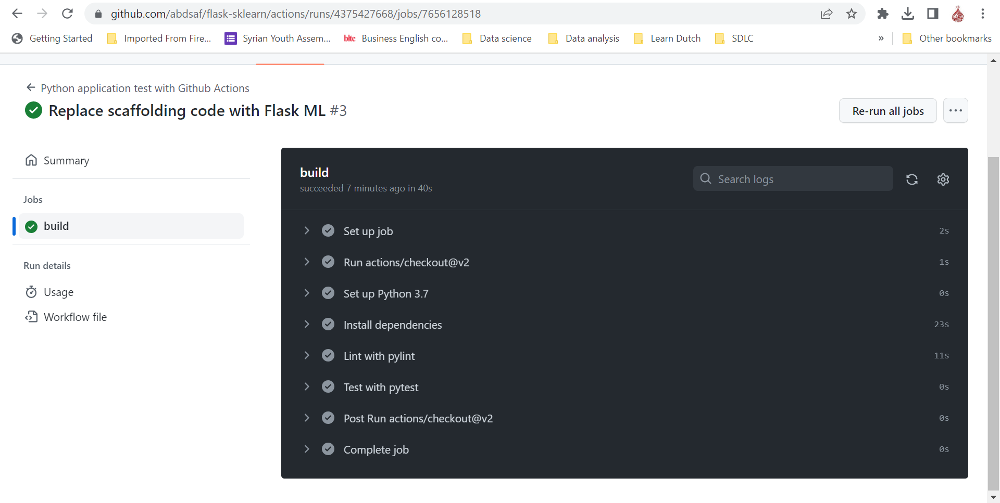
### Deploying to Azure App Services
Deploy app to Azure app services locally using Azure CLI:
```bash
(.flask-sklearn) odl_user [~/flask-sklearn]$ az webapp up -n flask-sklearn-abdsaf --sku F1 --resource-group Azuredevops
```

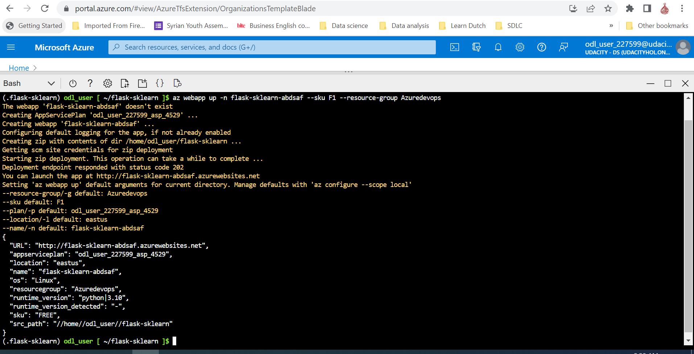

Check app if it is become online by using the link from the previous step output and open it via your internet browser

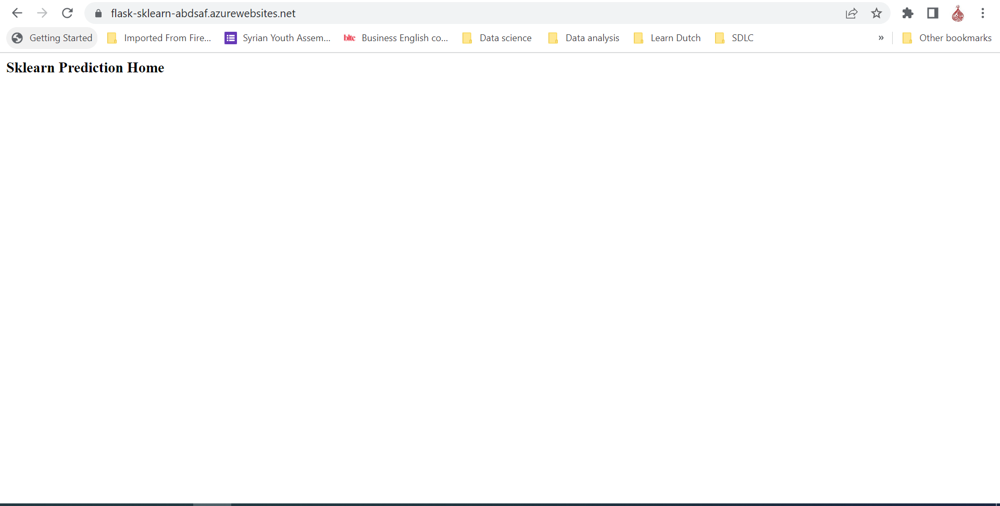

Now you will test the online app by invoke 'make_predict_azure_app.sh'  modify webapp name in the file
Edit file 'make_predict_azure_app.sh' and replace '< yourappname >' with your webapp name (e.g. flask-sklearn-abdsaf).

Test the remote webapp:
```bash
(.flask-sklearn) odl_user [~/flask-sklearn]$  ./make_predict_azure_app.sh
```
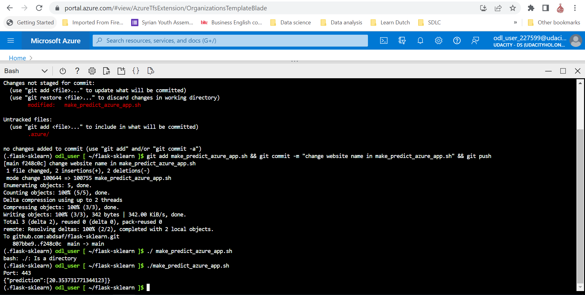


Logs of webapp can be easily done by tail linux command:

open cloud shell 

```bash
(.flask-sklearn) odl_user [~/flask-sklearn]$ az webapp log tail
```

validation of the webapp can be performed using [locust](https://locust.io).

Install locust tool 

(.flask-sklearn) odl_user [~/flask-sklearn]$ pip install locust

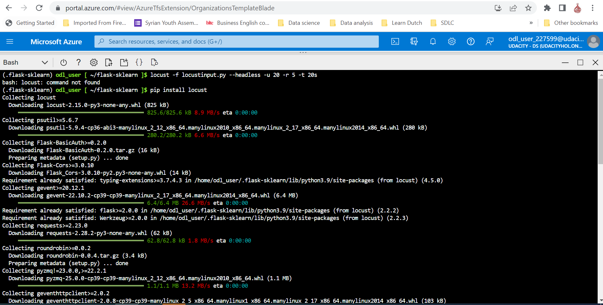

Open Template file 'locustinput.py' and Replace '< yourappname >':
```bash
(.flask-sklearn) odl_user [~/flask-sklearn]$ nano locustinput.py
(.flask-sklearn) odl_user [~/flask-sklearn]$ locust -f locustinput.py --headless -u 10 -r 3 -t 10s
```
This will generate requested for 10 users for 10 seconds by 3 users request per second 
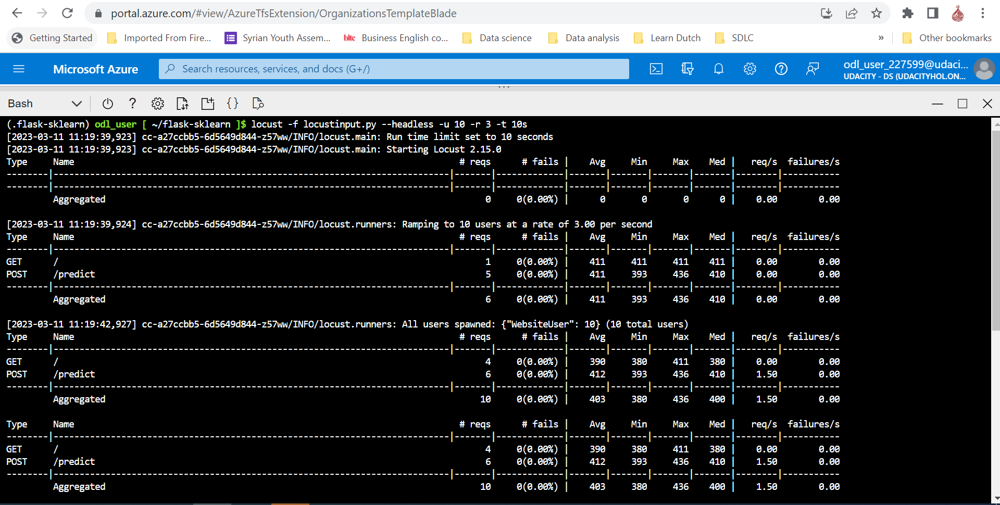

### Provisioning CI/CD using Azure Pipelines

Now it is time to performe CI/CD by using Azure DevOps Pipeline. This pipeline with pull the code from GitHub Repo and do all operations building, testing and deployment. Its so valuable to read more on Microsoft site about Azure DevOps and Pipeline https://learn.microsoft.com/en-us/azure/devops/pipelines/get-started/what-is-azure-pipelines?view=azure-devops.

Go to Azure devops from your Azure account  https://dev.azure.com.

Create a New Project.

Click on 'New pipeline' from the left panel.

Link your GitHub Repo to pipeline

Configure pipeline to deploy code to Azure app service ' which created in previous stage' by providing suitable inputs according to your Azure subscribtion

run the pipeline including the 'Build stage' and the 'Deploy Web App' based on yaml file:

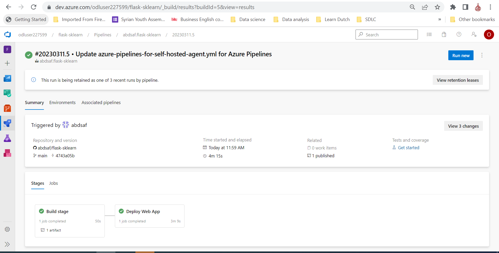

View pipeline log by click on build icon

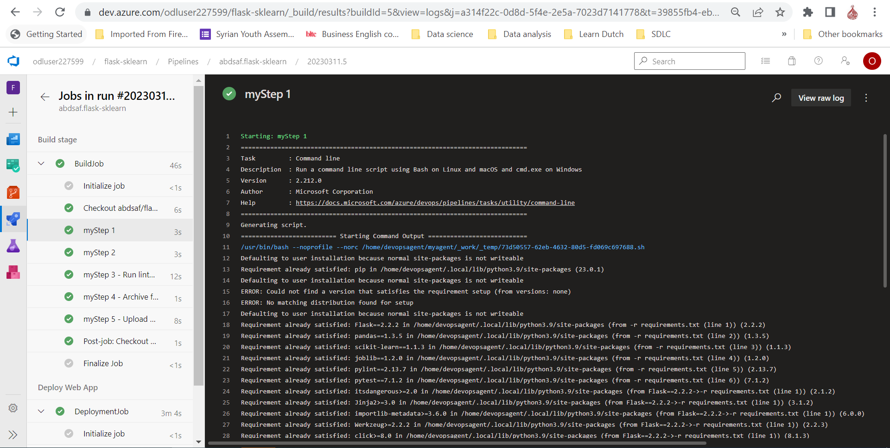

From now on every change to your code will trigger the CI/CD pipeline and update your webapp accordingly:

Change the application name in app.py from 'Sklearn Prediction Home' to 'Sklearn Prediction Home via Azure CI/CD Pipeline' and commit it:
```bash
(.flask-sklearn) odl_user [~/flask-sklearn]$ nano app.py
(.flask-sklearn) odl_user [~/flask-sklearn]$ git add app.py && git commit -m "Change app name" && git push
```
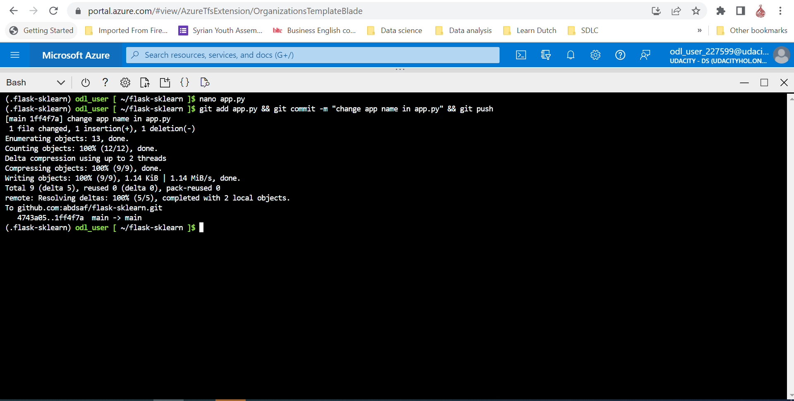

The pipeline is triggered by each  commit to GitHub Repo and actually that is the CI/CD

## Enhancements
Future improvements include but are not limited to:
* More test cases  using pytest
* preform automatically testing using testing module such as locust as script at the last step in  deployment stage


## Demo

This video demonstrates all previous steps:
[Demo Video](https://youtu.be/dskskRnAHz8)

